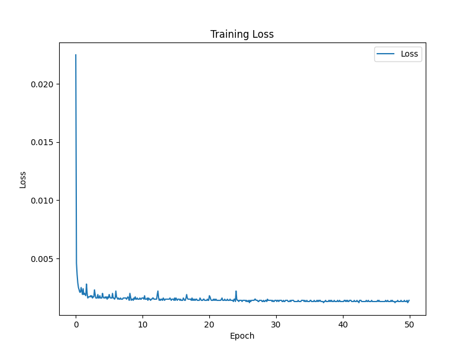
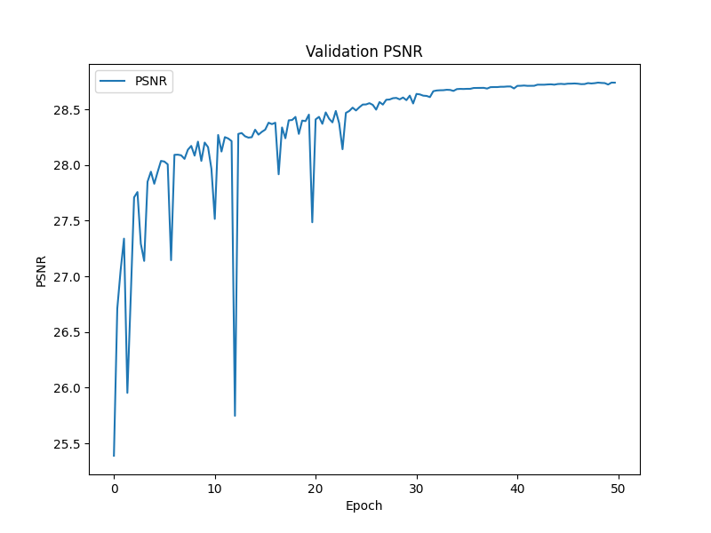
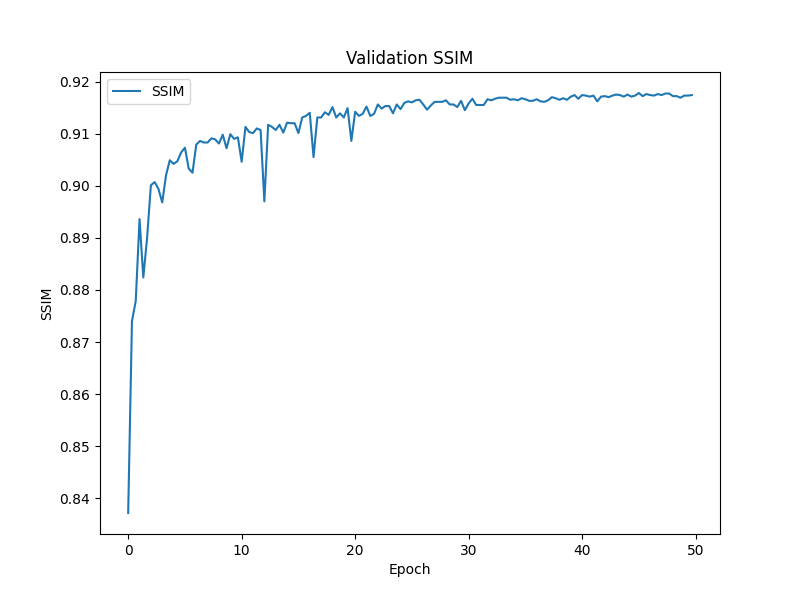

# Topic 3.2: Deep Learning: Image Upscaling

## Setup
We used uv during development to handle dependencies.

pip install uv
python3 -m uv sync 

this will create a venv you can use to run the code.

Alternatively, if you don't want to use uv, set up a python 3.10 installation and run pip install -r requirements.txt

(We assume you'll be using nvidia, so we did not include the RADEON specific torch versions we used for training in the requirements file)


Commands to download, train and test the model:

```shell
cd src
python3 get_dataset.py- #downloads the COCO dataset (it's quite large!)
python3 train.py #trains the model according to the parameters set in the config
python3 test.py #evaluates based on the model "model.pt" in the "model" subfolder
```

We used the cells in the more_plot_testing.ipynb notebook to make the graphs.

We also include the CC0 licensed dataset from https://www.kaggle.com/datasets/phucthaiv02/butterfly-image-classification in the data folder as butterflies_train (since our dataloaders do a train / test / val split anyhow)

## Results

The trained models can be found in `model/`.  
There are snapshots for each epoch and a final model.

| Model    | PSNR    | SSIM   |
|----------|---------|--------|
| model.pt | 28.3451 | 0.9179 |

### Visualizations

In the following our result after 100 epochs of training is displayed. 
In this case it is not the coco dataset but another smaller one we also used to compare.


Here the coco dataset results are shown:


### Dataset

The coco dataset was used to train the model. We used 10% of the dataset 
even though it was very large. (more than 12h training time)

### Training





