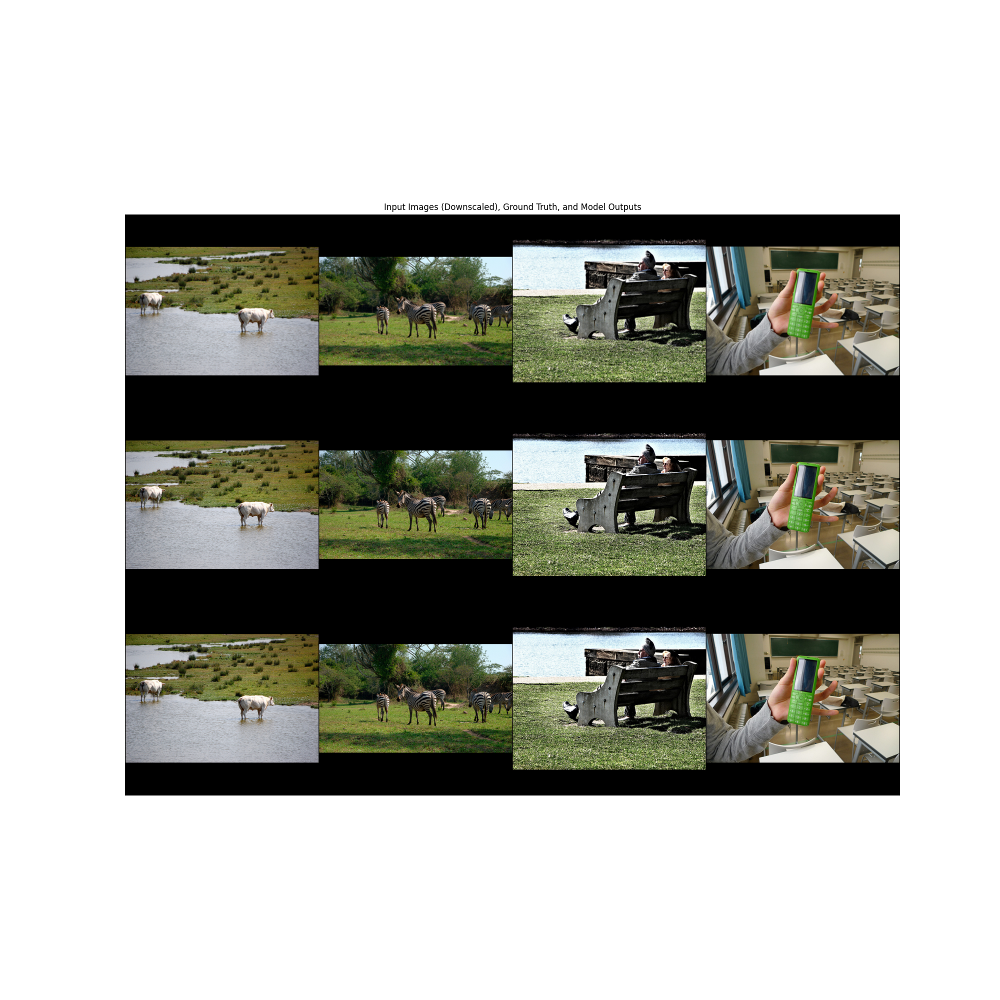

# Image Superresolution

## Setup

Run the following commands to install dependencies.  
You can also use your IDE to achieve this.

```shell
conda create -n TUW-ML_UE3 python=3.11
conda activate TUW-ML_UE3
pip install -r requirements.txt
```

Commands to download, train and test the model:

```shell
cd src
python get_dataset.py
python train.py
python test.py
```

## Results

The trained models can be found in `model/`.  
There are snapshots for each epoch and a final model.

| Model    | PSNR    | SSIM   |
|----------|---------|--------|
| model.pt | 28.9451 | 0.9194 |

### Visualizations

Here you can see 12 images (from model.pt), the first row being the downscaled images, the second row the ground truth
and the last row the upscaled images.



### Dataset

The coco dataset was used to train the model.  
Since this dataset is quite large, only 10% were used.

### Training

Training was done in 3 steps:

* Epoch 1-24 with a learning rate of 0.001
* Epoch 25-32 with a learning rate of 0.0005
* Epoch 33-50 with a learning rate of 0.0001


